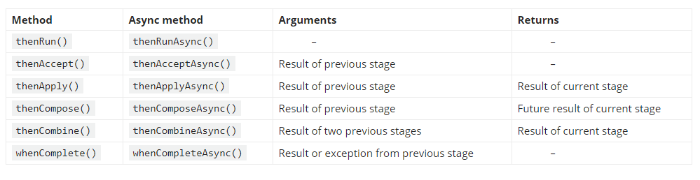

# Async Programming and Scheduling 🚀🚀🚀

> by Brad Wood & Luis Majano - Ortus Solutions

In this session, we will explore the concepts of asynchronous and parallel programming with the ColdBox Async Manager and Java’s Completable Futures APIs.  We will explore the concept of async computations, async pipelines, exception handling, scheduling and so much more. Pain 💊 medication is not included.

- 📧 **Email**: lmajano@ortussolutions.com, brad@ortussolutions.com
- 🐦 **Twitter**:
  - [@lmajano](https://twitter.com/lmajano)
  - [@bdw429s](https://twitter.com/bdw429s)
  - [@ortussolutions](https://twitter.com/ortussolutions)
- 🔗 **Site**: https://www.ortussolutions.com
- 📖 **Docs**: https://coldbox.ortusbooks.com/digging-deeper/promises-async-programming


## 📅 Agenda

### Introduction

> Brad

- Intros, Get to know you, What do you want from the workshop?

> Luis

- [√] The NB (non-blocking) movement
  - Has made NodeJS shine, but other languages support this as well.
  - Movement to more async/parallel computations
  - Overall movement to the async world
  - [√] Lessons from Callbacks
    - Also refered to as **Callback hell** 🔥
      - Example: [Callback Hell](samples/00-callback-hell.md)
    - Can make developers cry 😢
    - Never ending nesting collection of closures/functions 🕷️
    - Callbacks could be called multiple times by the other library.
    - Who has been there before?  Don't lie! 🤥
  - [√] Movement to promises
    - JavaScript has made this very popular
    - To get some sanity back into to development from call back hellfire 🔥
    - [√] What is a promise?
      - Can have 3 different states:
        - `Resolve` : When completed
        - `Reject`  : Error or something else
        - `Pending` : Not executing just yet
      - Cancel and Resolve them programmatically
      - Two channels of communication [Promises Track](samples/01-promises-track.md)
      - `Data`
      - `Error`
  - [] What about ColdFusion?
    - [√] `cfthread`, right?? right? right? 🤔
      - Great BUUUUUUT for **very very very very** basic threading
      - Easy, but plagued with issues, which makes developers **ALSO** cry :😢
        - No way to choose where it runs (thread pool)
        - No concept of returning data, it's up to you to monitor/track/report data
        - Hard to manage them (cancel, monitor, pause), you are on your own buddy!
        - No functional approaches to coding them
        - Managing multiple threads and joining can be cumbersome and terrifying 🧟‍♀️
        - Example: [Interceptor State Manager - Process Async All](coldbox/system/web/context/InterceptorState.cfc)
    - [√] `runAsync()` => Nothing existed until ACF2018/Lucee 5.3
      - A step up, but not a big step
      - Still Many Issues:
        - Backed by a custom wrapper to `java.util.concurrent.Future`
        - Simplistic error handler with no way to recover
        - No way to continue executing pipelines after an exception.
        - Concept of two tracks is broken!
        - No way to choose or reuse the executor to run the sub-sequent `then()` operations.
        - Lucee actually creates a new `singleThreadExecutor()` for EVERY `then()` operation.
        - No way to operate on multiple futures at once
          - [runAsync() example](samples/02-runAsync-limitations.cfc)
        - No way to combine/compose futures
        - Only works with closures, does not work on actually calling component methods
    - [√] `{x}map(), {x}each()` parallel processing
      - Adobe 2021+ & Lucee 5+
      - Limited to 50 threads in Adobe, 10 standard edition
      - Easy to use
      - Not easy to do exception handling, actually, you can't except wrap things in multiple try/catches
      - It does short circuit exception handling
        - **NO Control over it**
        - It will break out whenever an exception is detected and leave unprocessed items in a collection
        - No consistency
        - No logging
      - Example: [Native Parallel Programming](samples/03-parallel-native.cfc)
    - [√] Asynchronous Programming is NOT Easy!
      - [] Concurrency issues / Race conditions
        - Know the limitations on shared resources
        - Some data structures allow for multiple threads, some don’t, some you need to wrap to make them concurrent
          - `java.util.concurrent package` package
        - Read before write
        - Locking becomes part of your life, unfortunately
        - Atomic operations
        - Idempotent operations
        - Time stamps
      - [] Dealing with multiple threads
        - `cfthread` you have to be the manager
        - `runAsync` you can't be the manager
        - Sharing data between threads
      - [] No more `writedump/aborts`
        - Logs become your best friend
        - ColdBox Debugger Panels: tracers and request profilers
      - Easy to spot an asynchronous developers...... They are in the corner, crying! 😭
    - 🤢 We have three approaches to threading which are extremely simplistic and not very powerful at all.

### Intro to ColdBox Futures

> Brad

- [] 📦 ColdBox Futures are similar to JavaScript Promises but backed by the Java API of `CompletableFuture`
  - ☕️ JDK 8 Introduced `CompletableFutures`, `CompletionStages`, Executors, Lambdas and much more.
  - 🦄 Java `CompletableFutures` are like JavaScript Promises, but you know Java devs, over complicate things, even names!
  - We have ported the majority of this functionality to CFML: `ColdBox Futures`
    - ColdBox, WireBox, CacheBox and LogBox
  - Adapted for our dynamic language => many enhancements
  - [] `AsyncManager` class in charge of all async capabilities
    - **Standalone**: create an instance as a singleton
    - **ColdBox**:
      - `async()` helper in handlers/layouts/views/interceptors
      - `AsyncManager@coldbox` or `wirebox:asyncManager`
      - `Async@coreDelegates`
    - **Functions**:
      - Create Futures
      - Create/Manage Executors
      - Create/Manage Schedule Tasks
    - [] Intro to Executors
      - What is an executor
      - Default Executor is the Fork Join Pool
      - We can customize it and create new ones as well
  - [] Creating the Future!!
    - [] [cbFutures Stages](samples/04-cbfutures-stages.md)
    - [] [Create a future](samples/05-creating-future.cfc)
    - [Exercise 01](exercises/01-intro-to-futures.cfc)
    - [Solution 01](solutions/01-intro-to-futures.cfc)

### Magical Pipelines

> Luis

- [] 🎩 It's all about that pipeline |||||||
  - [] Java API: `thenApply()`, `thenAccept()`, `thenRun()`, why?
    - []
    - (http://codeflex.co/java-multithreading-completablefuture-explained/)
  - [] CF API: `then()` and `thenRun()` (Easier + Dynamic API)
    - [] Curiosity: `CompletableFutures` never end!  This is So Ironic! Sharknado! :shark:
  - [Magical Pipelines](samples/06-then.cfc)
  - [Data Transformations](samples/07-data-transformations.cfc)
  - [Dealing with Timeouts](samples/08-timeouts.cfc)
    - Success on timeout
    - Exception on timeout
  - [Checking status](samples/09-statuschecks.cfc)
  - Pipelines are independent of data
  - [Exercise 02](exercises/02-pipelines-and-statuses.cfc)
    - [Solution 02](solutions/02-pipelines-and-statuses.cfc)

### Dealing With Exceptions

> Brad

- [] Everybody has problems, our code has them too, sometimes...
  - Let's review the promises [data/error tracks](samples/04-cbfutures-stages.md)
- [] [Dealing with Exceptions](samples/10-exceptions.cfc)
- [] Built-in logging - [example](samples/10-exceptions-logging.cfc) @Brad
- [] `handle` methods - both results and exceptions - [example](samples/10-exceptions-handle.cfc) @Brad
- [] [Custom logging](samples/10-exceptions-custom-logging.cfc) @Brad
- [] Recovering with data - [example](samples/10-exceptions-recovery.cfc) @Brad
- [] [Exercise 03](exercises/03-exceptions.cfc)
  - [Solution 03](solutions/03-exceptions.cfc)

### Executors - Be the Manager

> Luis

- [] [Thread of execution](samples/11-nb-future.cfc)
- [] [Changing the pool](samples/12-custom-pool.cfc)
  - [] Register many different [types of executors/pool](samples/13-cached-pool.cfc)
    - [] `Fixed` : Control the amount of threads, cpu intensive, io intensive
    - [] `Single` : A processing queue FIFO
    - [] `Cached` : Ever expanding demand queue
    - [] `Scheduled` : Scheduled Tasks
  - [] [Checking status reinforcements](samples/09-statuschecks.cfc)
  - [] Shutdowns and awaiting terminations - [example](samples/14-shutdown-terminations.cfc) @Brad
  - [] Killing tasks? really? How?
  - [] [Exercise 04](exercises/04-executors.cfc)
    - [Solution 04](solutions/04-executors.cfc)

### Parallel Tasks

> Brad

- https://www.callicoder.com/java-8-completablefuture-tutorial/
- [Combining Futures](samples/15-combine.cfc)
  - Very much like a `reduce()` operations
  - Remember this: 1-1 operation
- [Composing Futures](samples/16-compose.cfc)
  - Monadic design pattern (https://medium.com/thg-tech-blog/monad-design-**pattern**-in-java-3391d4095b3f)
  - Hmm: 2-1 Operation, future of futures!
- [] Working with multiple futures
  - [Racing Futures](samples/17-anyOf.cfc)
  - [All Futures](samples/18-all.cfc)
  - [All futures Modified](samples/19-allapply.cfc)
- [] [Exercise 05](exercises/05-parallel-tasks.cfc)
  - [Solution 05](solutions/05-parallel-tasks.cfc)


### Q&A

> Brad & Luis

### Scheduled Tasks

[] What is a scheduler executor
[] Options in ColdBox
[] ;;

### Tips

To NOT show full stacktraces on exceptions, then run this in CommandBox

```bash
config set showVerboseErrors=false
```
